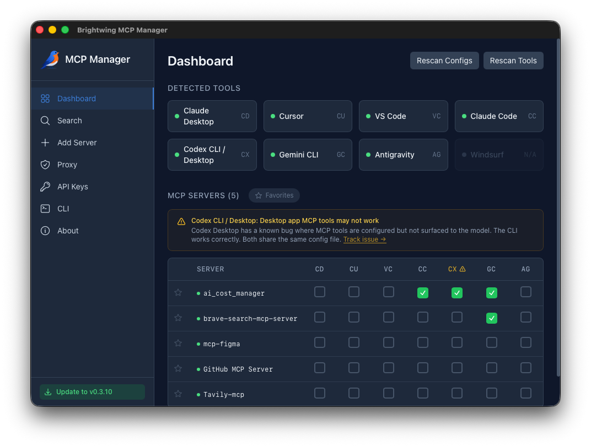
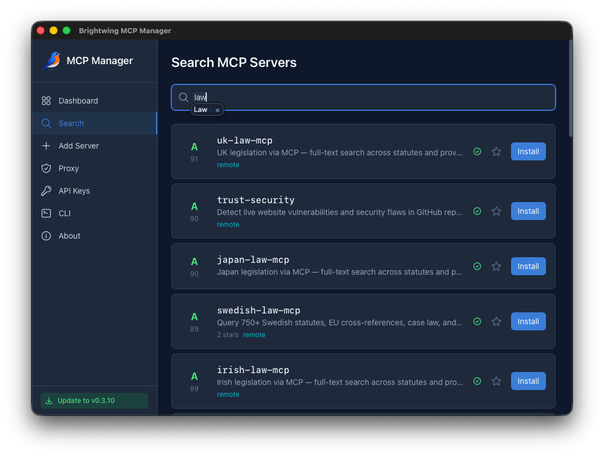
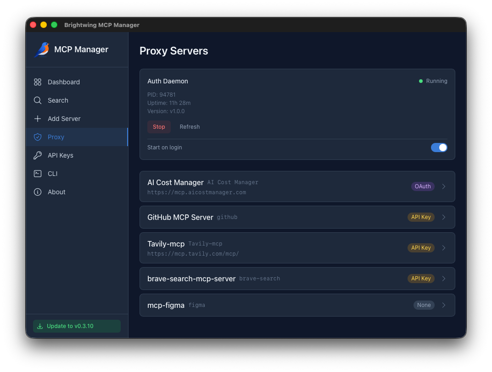
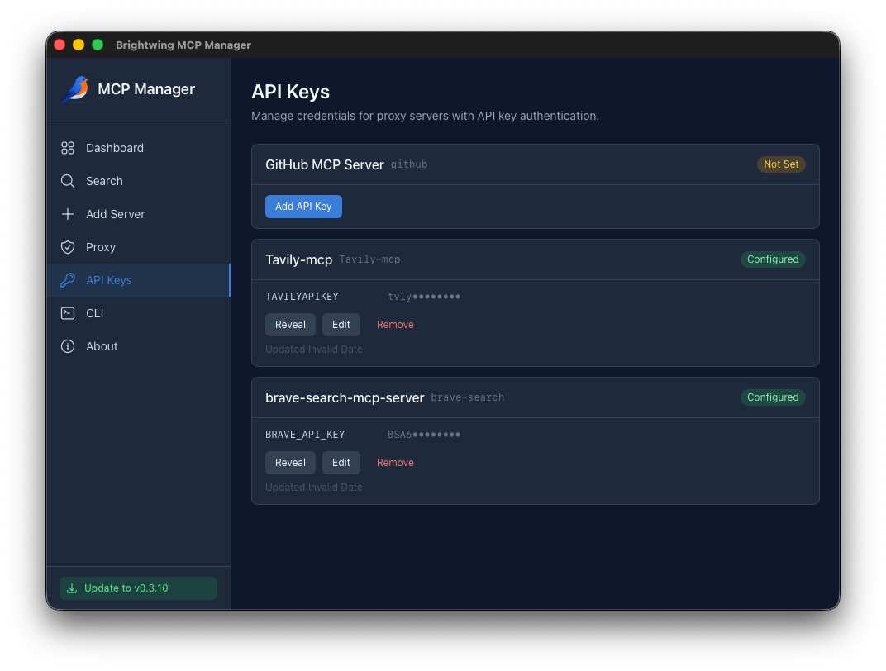
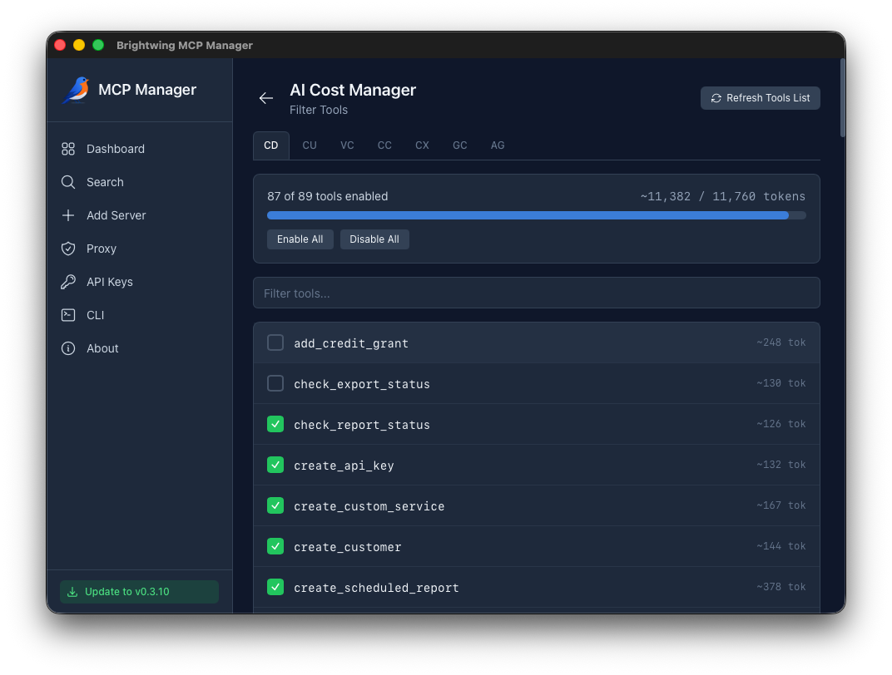
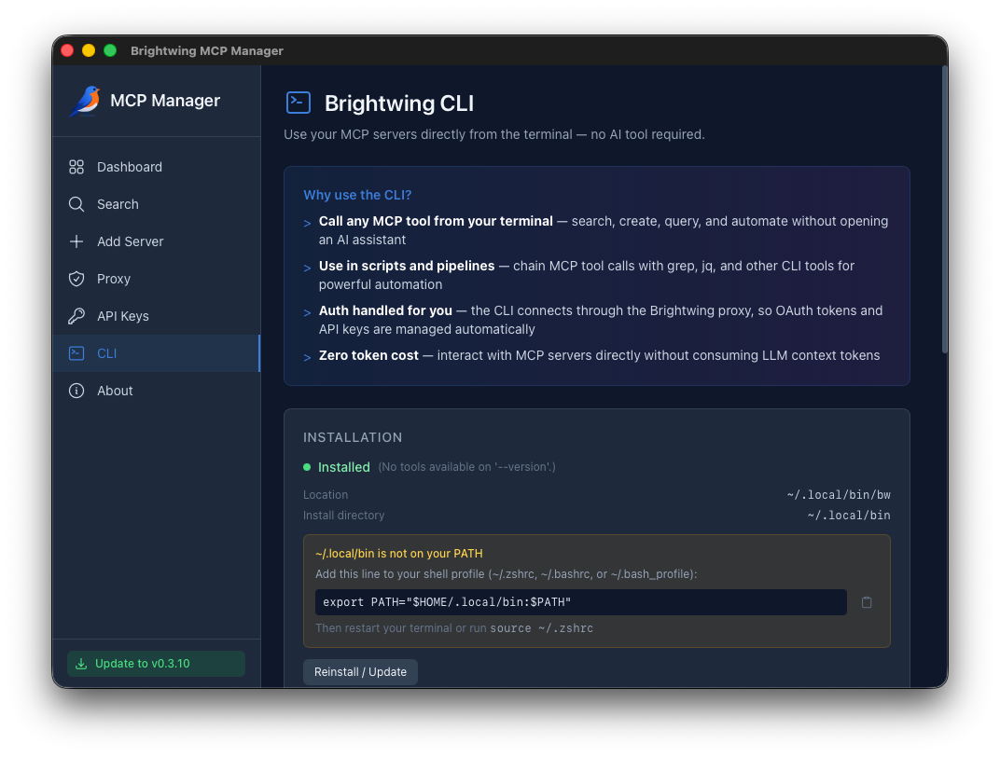

# Brightwing MCP Manager

**One app to install, authenticate, proxy, filter, and manage every MCP server across all your AI tools.**

MCP is powerful. Managing it is a nightmare. Every AI tool has its own config format, its own file location, its own quirks. OAuth tokens expire. API keys and tokens sit in plaintext JSON. Installing a new server means reading docs, editing configs by hand, and hoping you didn't break the JSON. And once it's running, every tool in every server gets dumped into your context window — whether you need it or not.

Brightwing MCP Manager fixes all of this. One desktop app. One control plane. Every AI tool you use.



---

## The Dashboard — Your MCP Command Center

The dashboard gives you a single view of every MCP server and every AI tool on your machine. See which servers are connected to which tools at a glance. Toggle servers on or off per tool with a single click. No more editing five different config files when you add a new server.

Brightwing automatically detects your installed AI tools — 20 and counting, from Claude Desktop and Cursor to Zed, Amp, and LM Studio — and keeps their configs in sync. Add a server once, enable it everywhere.


---

## Search & One-Click Install

Find and install MCP servers in seconds. The built-in search is powered by [MCP Scoreboard](https://mcpscoreboard.com), which grades public servers across six dimensions — schema quality, protocol conformance, reliability, documentation, security, and agent usability. See quality scores *before* you install, so you know exactly what you're integrating.

Click **Install**, pick your tools, and you're done. MCP Manager writes the correct config format for each tool (JSON, TOML, or CLI commands), sets up the proxy, and handles auth. No docs to read. No files to find. No JSON to hand-edit.



---

## Auth Proxy — Credentials That Never Touch Config Files

Every MCP server you install is routed through the Brightwing proxy. OAuth tokens and API keys are injected at request time — your AI tools never see raw credentials, and nothing sensitive lives in a config file.

The proxy runs as a lightweight local daemon with start-on-login support. From the Proxy page you can see every connected server, its auth type (OAuth, API Key, or None), and the daemon's status at a glance. Stop, refresh, and monitor — all from one place.



---

## Encrypted Credential Vault

API keys and OAuth tokens are stored in an encrypted [IOTA Stronghold](https://github.com/iotaledger/stronghold.rs) vault — not in plaintext JSON configs or SQLite databases where any process on your machine can read them. The vault encryption key is a random 32-byte secret stored in your OS keychain (macOS Keychain, Windows Credential Manager, or Linux Secret Service), so credentials are protected even if someone copies the vault file.

Add, reveal, edit, or remove keys per server. Existing plaintext keys and OAuth tokens are migrated into the vault automatically on first launch.



---

## Per-App Tool Filtering

An MCP server with 89 tools dumps every single one into your AI assistant's context window, eating thousands of tokens before you've even asked a question. That's real money and real latency — on every request.

MCP Manager shows you exactly how many tokens each tool's schema costs and lets you control which tools each app sees. The token budget bar updates live as you toggle tools on and off. Keep the full toolset enabled for Claude Code where you need it, but filter down to just the five tools Cursor actually uses. Configure different filter sets per app using the tabs across the top. Reclaim your context window. Cut your token costs.



---

## The `bw` CLI — MCP Without the AI

Call any MCP tool directly from your terminal. No AI assistant required. Search, create, query, automate — pipe results to `jq`, chain with `grep`, use in shell scripts. Auth is handled through the same proxy, so it just works.

The CLI page walks you through installation and keeps it updated. Zero configuration required.

```bash
$ bw list                                    # See all connected servers
$ bw "AI Cost Manager" get_costs --days 30   # Call a tool directly
$ bw "AI Cost Manager" get_costs --json | jq '.content[0].text'  # Pipe to jq
```



---

## Registry Governance — Corporate MCP Server Control

In a corporate environment you don't want every developer installing arbitrary MCP servers. Registry Governance gives administrators an allowlist-based policy layer that controls which servers can be installed across the organization.

### How It Works

1. **Admin activates governance** from the Governance page and sets a PIN
2. **Admin curates the allowlist** — adds approved MCP servers by identifier with review notes
3. **Users can only install allowed servers** — attempts to install anything not on the list are blocked with a clear message
4. **Users request new servers** — submit an approval request with a justification
5. **Admin reviews and approves/denies** — approved servers are automatically added to the allowlist
6. **Every action is audited** — the audit log records all governance events with timestamps

### Enforcement

When governance is enabled, the install command checks the allowlist _server-side in Rust_ before writing any config. This applies to both direct installs and proxy server registrations. Blocked attempts are logged in the audit trail.

### External Policy File (Tamper Resistance)

The in-app governance setup protects against casual changes, but a determined user could reinstall the app to get a fresh database. For true corporate enforcement, deploy an **external governance policy file** via MDM, GPO, or configuration management:

| Platform | Policy File Path |
|----------|-----------------|
| **macOS** | `/Library/Application Support/com.brightwing.mcp-manager/governance-policy.json` |
| **Linux** | `/etc/brightwing/governance-policy.json` |
| **Windows** | `C:\ProgramData\Brightwing\governance-policy.json` |

Example policy file:

```json
{
  "enforced": true,
  "exclusive": false,
  "org_name": "Acme Corp",
  "allowed_servers": [
    {
      "identifier": "github-mcp-server",
      "display_name": "GitHub MCP Server",
      "description": "Approved for all engineering teams"
    },
    {
      "identifier": "sentry-mcp",
      "display_name": "Sentry MCP Server"
    }
  ]
}
```

**Policy fields:**

| Field | Type | Description |
|-------|------|-------------|
| `enforced` | bool | When `true`, governance cannot be disabled from the app UI. Survives reinstall. |
| `exclusive` | bool | When `true`, _only_ servers listed in this file are allowed (the in-app allowlist is ignored). When `false`, the file's list is merged with the in-app allowlist. |
| `org_name` | string | Displayed in the Governance UI header (e.g. "Acme Corp — Managed server allowlist"). |
| `allowed_servers` | array | Servers that are always permitted. Each entry needs `identifier` and `display_name`. |

Because this file lives in a system-protected directory (`/Library/Application Support`, `/etc`, `C:\ProgramData`), regular users cannot modify or delete it. The app reads this file on every governance check, so:

- **Reinstalling the app** doesn't bypass governance — the policy file persists
- **Updating the app** doesn't reset governance — the Tauri updater replaces the app binary, not system config files
- **Deleting the database** doesn't help — the external policy file still enforces the allowlist

### Deployment Recommendations

For a corporate rollout:

1. **Deploy the policy file first** via your configuration management tool (Jamf, Intune, Ansible, GPO, etc.)
2. **Set `enforced: true`** so users cannot toggle governance off
3. **Start with `exclusive: false`** so local admins can add servers via the in-app allowlist while you build out the central list
4. **Migrate to `exclusive: true`** once your central allowlist is complete, for single-source-of-truth control
5. **Use the audit log** for compliance reporting — all install attempts (allowed and blocked) are recorded

---

## How It Works

```
┌──────────────┐                                    ┌──────────────┐
│ Claude Code  │──stdio──┐                   ┌──────│  GitHub MCP  │
├──────────────┤         │                   │      ├──────────────┤
│    Cursor    │──stdio──┤  ┌─────────────┐  │      │  Sentry MCP  │
├──────────────┤         ├──│  Brightwing │──┤      ├──────────────┤
│  VS Code     │──stdio──┤  │    Proxy    │  ├──────│  Stripe MCP  │
├──────────────┤         │  │             │  │      ├──────────────┤
│  Gemini CLI  │──stdio──┤  │ • Auth      │  │      │ Custom Server│
├──────────────┤         │  │ • Filtering │  │      ├──────────────┤
│    Codex     │──stdio──┘  │ • Logging   │──┘      │ Local Server │
└──────────────┘            └──────┬──────┘         └──────────────┘
                                   │
                            ┌──────┴──────┐
                            │   bw CLI    │
                            └─────────────┘
```

All AI tools connect to MCP servers through a local stdio proxy. The proxy handles:

- **Auth injection** — OAuth token refresh and API key insertion on every request
- **Encrypted vault** — API keys and OAuth tokens stored in Stronghold encrypted storage, with keychain-backed encryption keys
- **Tool filtering** — Per-app control over which tools are exposed (and how many tokens they cost)
- **Request logging** — See what's happening between your AI tools and MCP servers

---

## Supported AI Tools

Brightwing auto-detects these MCP-compatible tools on your machine and can install, configure, and proxy MCP servers for all of them:

| Tool | Config Format | Status |
|------|--------------|--------|
| Claude Desktop | JSON | Full support |
| Claude Code | CLI | Full support |
| Cursor | JSON | Full support |
| VS Code (Copilot) | JSON | Full support |
| Copilot (JetBrains) | JSON | Full support |
| GitHub Copilot CLI | JSON | Full support |
| OpenAI Codex CLI / Desktop | TOML | Full support |
| Gemini CLI | JSON | Full support |
| Amazon Q | JSON | Full support |
| Kiro | JSON | Full support |
| Windsurf | JSON | Full support |
| Antigravity | JSON | Full support |
| Amp | JSON | Full support |
| Zed | JSON | Full support |
| Cline | JSON | Full support |
| Roo Code | JSON | Full support |
| OpenCode | JSON | Full support |
| Pi | JSON | Full support |
| LM Studio | JSON | Full support |
| Junie CLI | JSON | Full support |

Using an MCP-compatible tool that's not on this list? [Open an issue](https://github.com/Brightwing-Systems-LLC/mcp-manager/issues) and we'll add support for it.

## Platform Support

| Platform | Status | Notes |
|----------|--------|-------|
| **macOS** (Apple Silicon & Intel) | Beta | Primary development platform. Fully functional. |
| **Linux** (x64) | Beta | Fully functional. AppImage and .deb packages. |
| **Windows** (x64) | **Alpha** | Core UI works. Proxy and CLI shim untested on real hardware. [File bugs here.](https://github.com/Brightwing-Systems-LLC/mcp-manager/issues) |

## Download

Pre-built binaries on the [Releases](https://github.com/Brightwing-Systems-LLC/mcp-manager/releases) page.

| Platform | File |
|----------|------|
| macOS (Apple Silicon) | `Brightwing.MCP.Manager_x.x.x_aarch64.dmg` |
| macOS (Intel) | `Brightwing.MCP.Manager_x.x.x_x64.dmg` |
| Windows (64-bit) | `Brightwing.MCP.Manager_x.x.x_x64-setup-ALPHA.exe` |
| Linux (Debian/Ubuntu) | `Brightwing.MCP.Manager_x.x.x_amd64.deb` |
| Linux (AppImage) | `Brightwing.MCP.Manager_x.x.x_amd64.AppImage` |

### Unsigned Build Workarounds

Builds are not yet code-signed. Your OS will warn you on first run.

**macOS:**
1. Open the `.dmg` and drag to Applications
2. Go to **System Settings > Privacy & Security**, find the "blocked" message, click **Open Anyway**
3. Or run: `xattr -cr "/Applications/Brightwing MCP Manager.app"`

**Windows:**
1. Run the installer. SmartScreen will warn you.
2. Click **More info** > **Run anyway**

**Linux (AppImage):**
```bash
chmod +x brightwing-mcp-manager_*.AppImage
./brightwing-mcp-manager_*.AppImage
```

## Build from Source

### Prerequisites

- [Node.js](https://nodejs.org/) 20+
- [Rust](https://rustup.rs/) (stable)
- Platform deps:
  - **macOS**: `xcode-select --install`
  - **Linux**: `sudo apt install libwebkit2gtk-4.1-dev libappindicator3-dev librsvg2-dev patchelf`
  - **Windows**: [Visual Studio Build Tools](https://visualstudio.microsoft.com/visual-cpp-build-tools/) with C++ workload

### Steps

```bash
git clone https://github.com/Brightwing-Systems-LLC/mcp-manager.git
cd mcp-manager
npm install
npx tauri dev        # Development mode
npx tauri build      # Production build
```

The built app will be in `src-tauri/target/release/bundle/`.

## Architecture

```
src/                     # React frontend (TypeScript)
├── components/          # Dashboard, ServerDetail, ToolFilterPanel, CliPage, etc.
├── lib/                 # Types, Tauri invoke wrappers
└── store.ts             # Zustand state management

src-tauri/               # Rust backend
├── src/
│   ├── bin/             # Sidecar binaries (brightwing-authd, brightwing-proxy, bw)
│   ├── config/          # Config reader/writer for all tool formats
│   ├── db/              # SQLite database (servers, filters, credentials, logs)
│   ├── proxy/           # Tool discovery, MCP Streamable HTTP client
│   ├── tools/           # Tool definitions, scanner
│   └── lib.rs           # Tauri commands
└── crates/
    └── proxy-common/    # Shared IPC protocol, token estimation
```

## Deep Links

MCP Manager registers the `brightwing://` URL scheme for one-click installs:

```
brightwing://install?server=<uuid>&tool=<tool_id>
```

Used by [MCP Scoreboard](https://mcpscoreboard.com) for "Install with Brightwing" buttons.

## Roadmap

- [x] Unified dashboard with cross-tool sync
- [x] Auto-update via Tauri updater plugin
- [x] Auth proxy with OAuth and API key injection
- [x] Per-app tool filtering with token budget display
- [x] CLI shim (`bw`) for terminal-native MCP access
- [x] MCP Streamable HTTP support for tool discovery
- [x] Proxy request logging
- [ ] `notifications/tools/list_changed` push to connected clients
- [x] Encrypted credential vault (Stronghold + OS keychain)
- [x] Registry governance with allowlist, approval workflow, and audit log
- [x] External governance policy file for MDM/GPO enforcement
- [ ] Code signing for macOS, Windows, and Linux
- [ ] Windows platform hardening

## Independence Statement

MCP Scoreboard and MCP Manager are independent projects built by [Brightwing Systems, LLC](https://brightwingsystems.com). We are not affiliated with, endorsed by, or sponsored by the Linux Foundation, AAIF, Anthropic, or any other organization involved in the governance of the Model Context Protocol.

"Model Context Protocol" and "MCP" are trademarks of the Linux Foundation. All trademarks belong to their respective owners.

## License

Proprietary. Copyright 2026 Brightwing Systems LLC.
