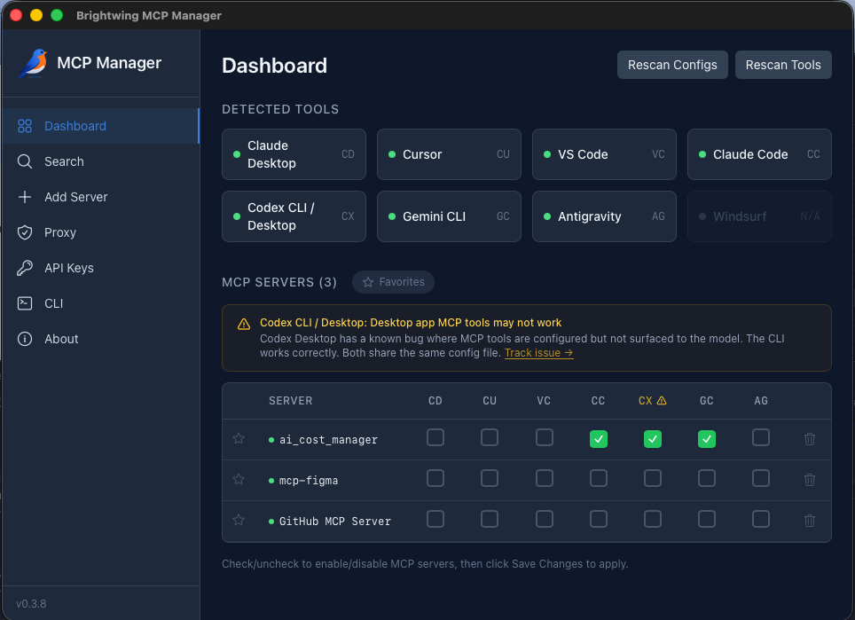

# Brightwing MCP Manager

**One app to install, authenticate, proxy, filter, and manage every MCP server across all your AI tools.**

Stop hand-editing JSON configs. Stop copy-pasting OAuth tokens. Stop wondering why your AI assistant burned 12,000 tokens before it even started thinking about your prompt.

MCP Manager is a desktop app that gives you a single control plane for all your MCP servers across Claude Desktop, Cursor, VS Code, Claude Code, Gemini CLI, Codex, and more.



## Why MCP Manager?

### Auth Proxy
Every MCP server you install is routed through the Brightwing proxy. OAuth tokens and API keys are injected automatically — your AI tools never see raw credentials, and nothing sensitive lives in config files.

### Per-App Tool Filtering
An MCP server with 89 tools dumps all of them into your AI assistant's context window, eating thousands of tokens before you've even asked a question. MCP Manager lets you control exactly which tools each app sees. Filter out what you don't need, per app, and reclaim that context space.

### One-Click Install
Search for servers, click Install, pick your tools — done. MCP Manager writes the correct config format for each tool (JSON, TOML, or CLI commands), handles the proxy setup, and manages auth. No more reading docs to figure out where Cursor keeps its config file.

### CLI Access (`bw`)
Call any MCP tool directly from your terminal — no AI assistant required. Pipe results to `jq`, chain with `grep`, use in shell scripts. Auth is handled through the same proxy, so it just works.

```bash
$ bw list                                    # See all connected servers
$ bw "AI Cost Manager" get_costs --days 30   # Call a tool directly
$ bw "AI Cost Manager" get_costs --json | jq '.content[0].text'  # Pipe to jq
```

### Quality Scores via MCP Scoreboard
The built-in search is powered by [MCP Scoreboard](https://patchworkmcp.com/scoreboard/), which scores public MCP servers across six dimensions — schema quality, protocol conformance, reliability, documentation, security, and agent usability. See grades before you install, so you know what you're integrating.

---

## How It Works

```
┌──────────────┐                                    ┌──────────────┐
│ Claude Code  │──stdio──┐                   ┌──────│  GitHub MCP  │
├──────────────┤         │                   │      ├──────────────┤
│    Cursor    │──stdio──┤  ┌─────────────┐  │      │  Sentry MCP  │
├──────────────┤         ├──│  Brightwing │──┤      ├──────────────┤
│  VS Code     │──stdio──┤  │    Proxy    │  ├──────│  Stripe MCP  │
├──────────────┤         │  │             │  │      ├──────────────┤
│  Gemini CLI  │──stdio──┤  │ • Auth      │  │      │ Custom Server│
├──────────────┤         │  │ • Filtering │  │      ├──────────────┤
│    Codex     │──stdio──┘  │ • Logging   │──┘      │ Local Server │
└──────────────┘            └──────┬──────┘         └──────────────┘
                                   │
                            ┌──────┴──────┐
                            │   bw CLI    │
                            └─────────────┘
```

All AI tools connect to MCP servers through a local stdio proxy. The proxy handles:

- **Auth injection** — OAuth token refresh and API key insertion on every request
- **Tool filtering** — Per-app control over which tools are exposed (and how many tokens they cost)
- **Request logging** — See what's happening between your AI tools and MCP servers

## Supported Tools

| Tool | Config Format | Status |
|------|--------------|--------|
| Claude Desktop | JSON | Full support |
| Cursor | JSON | Full support |
| VS Code (Copilot) | JSON | Full support |
| Claude Code | CLI (`claude mcp`) | Full support |
| OpenAI Codex | TOML | Full support |
| Gemini CLI | JSON | Full support |
| Windsurf | JSON | Full support |
| Antigravity | JSON | Full support |

## Platform Support

| Platform | Status | Notes |
|----------|--------|-------|
| **macOS** (Apple Silicon & Intel) | Beta | Primary development platform. Fully functional. |
| **Linux** (x64) | Beta | Fully functional. AppImage and .deb packages. |
| **Windows** (x64) | **Alpha** | Core UI works. Proxy and CLI shim untested on real hardware. [File bugs here.](https://github.com/Brightwing-Systems-LLC/mcp-manager/issues) |

## Download

Pre-built binaries on the [Releases](https://github.com/Brightwing-Systems-LLC/mcp-manager/releases) page.

| Platform | File |
|----------|------|
| macOS (Apple Silicon) | `Brightwing.MCP.Manager_x.x.x_aarch64.dmg` |
| macOS (Intel) | `Brightwing.MCP.Manager_x.x.x_x64.dmg` |
| Windows (64-bit) | `Brightwing.MCP.Manager_x.x.x_x64-setup-ALPHA.exe` |
| Linux (Debian/Ubuntu) | `Brightwing.MCP.Manager_x.x.x_amd64.deb` |
| Linux (AppImage) | `Brightwing.MCP.Manager_x.x.x_amd64.AppImage` |

### Unsigned Build Workarounds

Builds are not yet code-signed. Your OS will warn you on first run.

**macOS:**
1. Open the `.dmg` and drag to Applications
2. Go to **System Settings > Privacy & Security**, find the "blocked" message, click **Open Anyway**
3. Or run: `xattr -cr "/Applications/Brightwing MCP Manager.app"`

**Windows:**
1. Run the installer. SmartScreen will warn you.
2. Click **More info** > **Run anyway**

**Linux (AppImage):**
```bash
chmod +x brightwing-mcp-manager_*.AppImage
./brightwing-mcp-manager_*.AppImage
```

## Build from Source

### Prerequisites

- [Node.js](https://nodejs.org/) 20+
- [Rust](https://rustup.rs/) (stable)
- Platform deps:
  - **macOS**: `xcode-select --install`
  - **Linux**: `sudo apt install libwebkit2gtk-4.1-dev libappindicator3-dev librsvg2-dev patchelf`
  - **Windows**: [Visual Studio Build Tools](https://visualstudio.microsoft.com/visual-cpp-build-tools/) with C++ workload

### Steps

```bash
git clone https://github.com/Brightwing-Systems-LLC/mcp-manager.git
cd mcp-manager
npm install
npx tauri dev        # Development mode
npx tauri build      # Production build
```

The built app will be in `src-tauri/target/release/bundle/`.

## Architecture

```
src/                     # React frontend (TypeScript)
├── components/          # Dashboard, ServerDetail, ToolFilterPanel, CliPage, etc.
├── lib/                 # Types, Tauri invoke wrappers
└── store.ts             # Zustand state management

src-tauri/               # Rust backend
├── src/
│   ├── bin/             # Sidecar binaries (brightwing-authd, brightwing-proxy, bw)
│   ├── config/          # Config reader/writer for all tool formats
│   ├── db/              # SQLite database (servers, filters, credentials, logs)
│   ├── proxy/           # Tool discovery, MCP Streamable HTTP client
│   ├── tools/           # Tool definitions, scanner
│   └── lib.rs           # Tauri commands
└── crates/
    └── proxy-common/    # Shared IPC protocol, token estimation
```

## Deep Links

MCP Manager registers the `brightwing://` URL scheme for one-click installs:

```
brightwing://install?server=<uuid>&tool=<tool_id>
```

Used by [MCP Scoreboard](https://mcpscoreboard.com) for "Install with Brightwing" buttons.

## Roadmap

- [x] Unified dashboard with cross-tool sync
- [x] Auto-update via Tauri updater plugin
- [x] Auth proxy with OAuth and API key injection
- [x] Per-app tool filtering with token budget display
- [x] CLI shim (`bw`) for terminal-native MCP access
- [x] MCP Streamable HTTP support for tool discovery
- [x] Proxy request logging
- [ ] `notifications/tools/list_changed` push to connected clients
- [ ] Encrypted API key vault (Stronghold)
- [ ] Code signing for macOS, Windows, and Linux
- [ ] Windows platform hardening

## Independence Statement

MCP Scoreboard and MCP Manager are independent projects built by [Brightwing Systems, LLC](https://brightwingsystems.com). We are not affiliated with, endorsed by, or sponsored by the Linux Foundation, AAIF, Anthropic, or any other organization involved in the governance of the Model Context Protocol.

"Model Context Protocol" and "MCP" are trademarks of the Linux Foundation. All trademarks belong to their respective owners.

## License

Proprietary. Copyright 2026 Brightwing Systems LLC.
